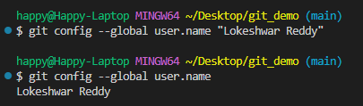
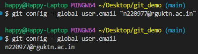
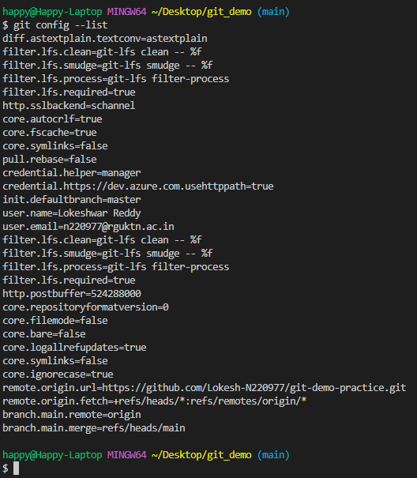
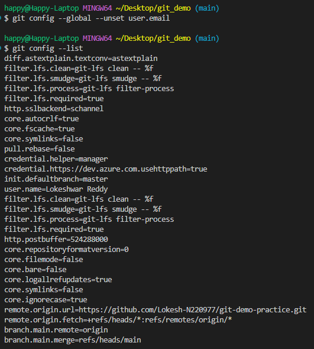

### Command: git config --global user.name

**Syntax**
git config --global user.name "Your Name"

**Purpose**
Sets the global username used in Git commits.

**Example**
git config --global user.name "Lokeshwar Reddy"

**Screenshot**

### Command: git config --global user.email

**Syntax**
git config --global user.email "your-email@example.com"

**Purpose**
Sets the global email used in Git commits.

**Example**
git config --global user.email "lokesh@example.com"

**Screenshot**

### Command: git config --list

**Syntax**
git config --list

**Purpose**
Displays all Git configuration settings.

**Example**
git config --list

**Screenshot**

### Command: git config --unset

**Syntax**
git config --global --unset user.email

**Purpose**
Removes a specific Git configuration setting.

**Example**
git config --global --unset user.email

**Screenshot**

